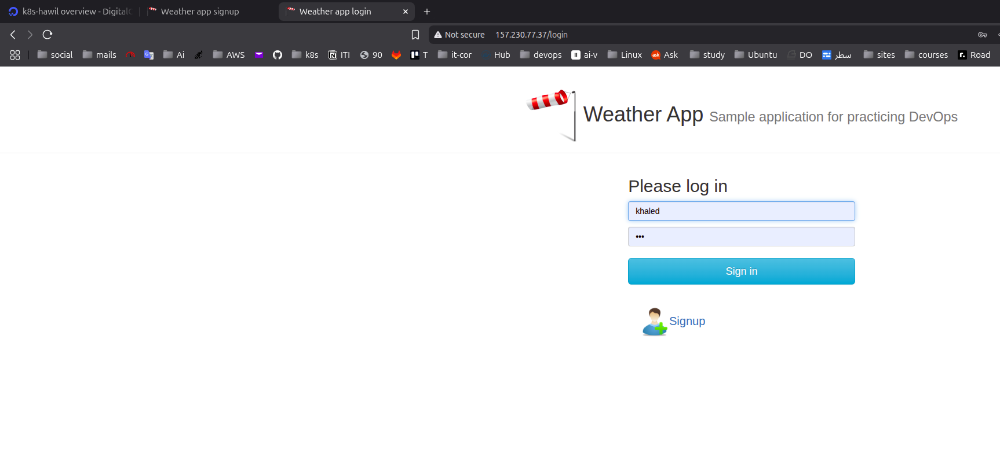
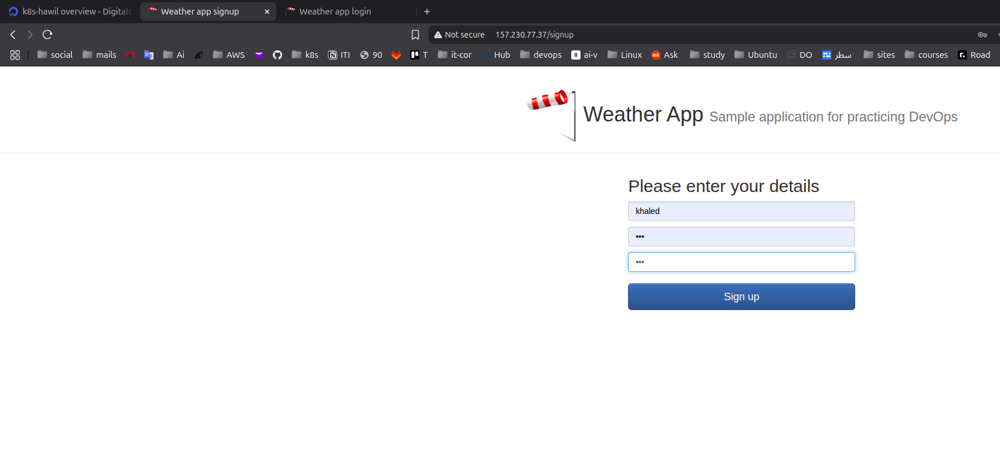
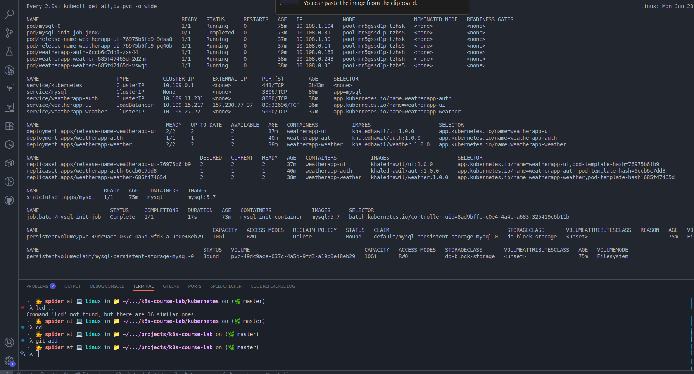
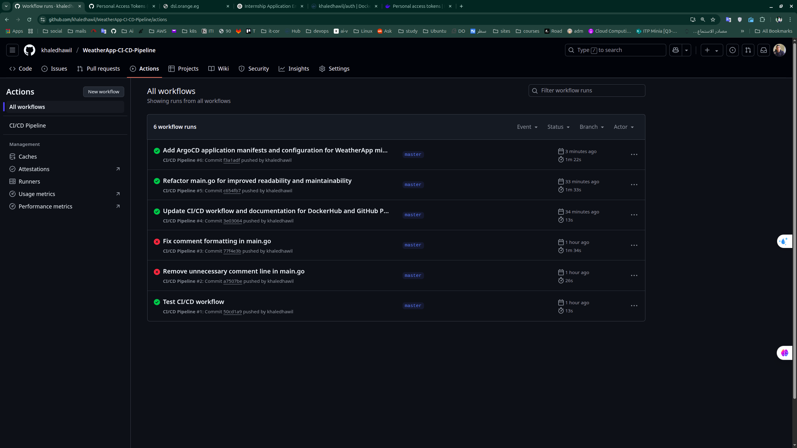
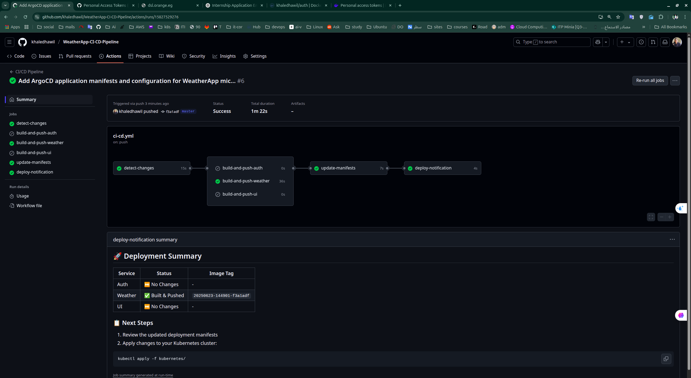
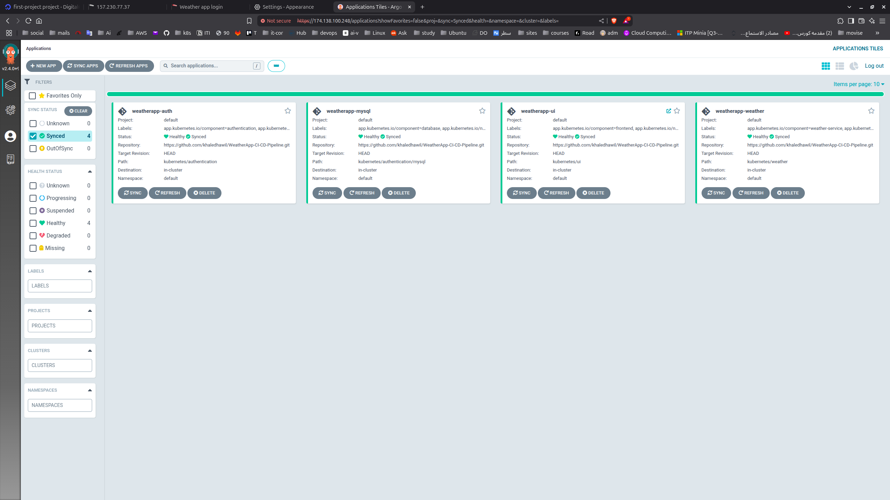

# Kubernetes Weather Application

A production-ready microservices weather application deployed on DigitalOcean Kubernetes cluster with complete CI/CD pipeline using GitHub Actions and ArgoCD for GitOps deployment.

## Project Overview

This project demonstrates a complete cloud-native solution featuring:
- Microservices architecture with authentication, weather data, and responsive UI
- Kubernetes deployment on DigitalOcean with persistent storage and load balancing
- Automated CI/CD pipeline with GitHub Actions
- GitOps deployment using ArgoCD
- Production-ready monitoring, security, and scalability features

## Screenshots

### Application Interface


*Secure user authentication with JWT token-based session management*


*User registration form with input validation and secure password handling*


*Main weather interface displaying real-time weather data with responsive design*

### Infrastructure and Deployment


*Live view of Kubernetes cluster resources running on DigitalOcean*


*GitHub Actions CI/CD pipeline showing automated builds and deployments*


*Detailed view of CI/CD pipeline stages including build, test, and deploy phases*


*ArgoCD GitOps dashboard managing all application deployments*

## Architecture

### Microservices Components

**Authentication Service (Go)**
- JWT-based authentication with secure password hashing
- Database integration with MySQL
- Health checks and monitoring endpoints
- Image: `khaledhawil/auth:latest`

**Weather Service (Python/Flask)**
- OpenWeatherMap API integration
- CORS support and error handling
- Rate limiting and caching
- Image: `khaledhawil/weather:latest`

**UI Service (Node.js/Express)**
- Responsive web interface with EJS templating
- Session management and security middleware
- Real-time weather data display
- Image: `khaledhawil/ui:latest`

**MySQL Database**
- Persistent storage with DigitalOcean Block Storage
- StatefulSet deployment with ordered scaling
- Automated initialization and backup capabilities
- Image: `mysql:5.7`

### Infrastructure Stack

**Kubernetes Platform**
- DigitalOcean Kubernetes (DOKS) cluster
- LoadBalancer for external access
- Persistent volumes with Block Storage
- NGINX Ingress Controller with SSL/TLS

**CI/CD Pipeline**
- GitHub Actions for automated builds
- Docker image management with semantic versioning
- Selective building based on code changes
- ArgoCD for GitOps deployment

## Project Structure

```
k8s-course-lab/
├── auth/                          # Authentication service (Go)
├── weather/                       # Weather service (Python)
├── UI/                           # Frontend service (Node.js)
├── kubernetes/                    # Kubernetes manifests
│   ├── authentication/
│   │   ├── deployment.yaml
│   │   ├── service.yaml
│   │   └── mysql/
│   ├── weather/
│   └── ui/
├── .github/workflows/            # GitHub Actions CI/CD
├── argocd/                       # ArgoCD applications
├── docs/                         # Documentation
└── scripts/                      # Utility scripts
```

## CI/CD Pipeline

### GitHub Actions Workflow

The automated CI/CD pipeline provides:

- **Selective Building**: Only builds services with code changes
- **Docker Image Management**: Automatic tagging with timestamp and commit SHA
- **Manifest Updates**: Updates Kubernetes deployment files with new image tags
- **Loop Prevention**: Uses `[skip ci]` to prevent infinite workflows

### Required GitHub Secrets

```
DOCKERHUB_USERNAME=khaledhawil
DOCKERHUB_TOKEN=<your_dockerhub_access_token>
PERSONAL_ACCESS_TOKEN=<your_github_personal_access_token>
```

### Image Tagging Strategy

Format: `YYYYMMDD-HHMMSS-shortsha`
Example: `khaledhawil/auth:20240315-143022-a1b2c3d`

## ArgoCD GitOps Deployment

### Application Management

ArgoCD manages four main applications:
1. **weatherapp-mysql** (Sync Wave: 1) - Database components
2. **weatherapp-auth** (Sync Wave: 2) - Authentication service
3. **weatherapp-weather** (Sync Wave: 3) - Weather service
4. **weatherapp-ui** (Sync Wave: 4) - Frontend service

### Deployment Options

**Option 1: App-of-Apps Pattern (Recommended)**
```bash
kubectl apply -f argocd/app-of-apps.yaml
```

**Option 2: Individual Applications**
```bash
kubectl apply -f argocd/weatherapp-mysql.yaml
kubectl apply -f argocd/weatherapp-auth.yaml
kubectl apply -f argocd/weatherapp-weather.yaml
kubectl apply -f argocd/weatherapp-ui.yaml
```

## Quick Start

### Prerequisites

- Kubernetes cluster with kubectl configured
- ArgoCD installed in cluster
- GitHub repository with required secrets configured
- OpenWeatherMap API key

### Deployment Steps

1. **Setup Secrets**
   ```bash
   kubectl create secret generic mysql-secret \
     --from-literal=root-password='your-root-password' \
     --from-literal=auth-password='your-auth-password' \
     --from-literal=secret-key='your-jwt-secret'
   
   kubectl create secret generic weather-secret \
     --from-literal=apikey='your-openweathermap-api-key'
   ```

2. **Deploy with ArgoCD**
   ```bash
   kubectl apply -f argocd/app-of-apps.yaml
   ```

3. **Verify Deployment**
   ```bash
   kubectl get applications -n argocd
   kubectl get pods -n default
   kubectl get services -n default
   ```

### Local Development

Each service can be run locally:

```bash
# Authentication service
cd auth && go run main/main.go

# Weather service  
cd weather && python main.py

# UI service
cd UI && npm start
```

## Monitoring and Operations

### Health Checks
- Liveness and readiness probes for all services
- Automatic pod restart on failures
- Resource limits and requests configured

### Scaling
```bash
# Horizontal scaling
kubectl scale deployment weatherapp-auth --replicas=3

# Check scaling status
kubectl get deployments
```

### Troubleshooting
```bash
# Check application logs
kubectl logs -f deployment/weatherapp-auth

# Check ArgoCD application status
kubectl get applications -n argocd

# Debug pod issues
kubectl describe pod <pod-name>
```

## Security Features

- JWT-based authentication with secure password hashing
- Kubernetes secrets for sensitive data management
- Network policies for traffic isolation
- SSL/TLS encryption via ingress controller
- Rate limiting and input validation

## Documentation

### Kubernetes Manifests
- [MySQL Components](kubernetes/authentication/mysql/)
- [Authentication Service](kubernetes/authentication/)
- [Weather Service](kubernetes/weather/)
- [UI Service](kubernetes/ui/)

### CI/CD and GitOps
- [CI/CD Workflow Guide](docs/ci-cd-workflow.md)
- [GitHub Secrets Setup](docs/github-secrets.md)
- [ArgoCD Configuration](argocd/README.md)

## Production Considerations

### Performance
- LoadBalancer for high availability
- Persistent storage with automatic backups
- Resource optimization and scaling policies
- CDN integration for static assets

### Security
- RBAC policies for cluster access
- Network policies for pod isolation
- Regular security updates and scanning
- SSL certificate management

### Monitoring
- Application metrics and logging
- Cluster resource monitoring
- Alerting for critical issues
- Distributed tracing capabilities

## Technology Stack

**Backend Services**
- Go (Authentication service)
- Python/Flask (Weather service)
- Node.js/Express (UI service)
- MySQL (Database)

**Infrastructure**
- Kubernetes (Container orchestration)
- DigitalOcean (Cloud platform)
- Docker (Containerization)
- NGINX (Ingress controller)

**DevOps Tools**
- GitHub Actions (CI/CD)
- ArgoCD (GitOps)
- Docker Hub (Container registry)
- kubectl (Kubernetes CLI)

## Contributing

1. Fork the repository
2. Create a feature branch
3. Make your changes
4. Test thoroughly
5. Update documentation
6. Submit a pull request

## Support

For issues and questions:
- Review the troubleshooting section
- Check individual component documentation
- Create an issue in the project repository
- Test deployment on a local cluster first
