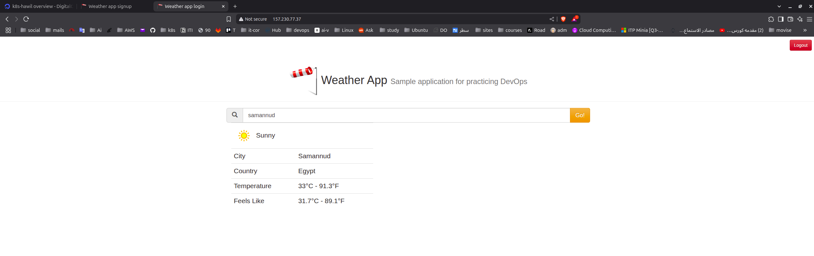

# Kubernetes Weather Application

A production-ready microservices weather application deployed on DigitalOcean Kubernetes cluster with LoadBalancer integration and persistent storage.

## Project Overview

This project demonstrates a complete Kubernetes deployment of a weather application featuring user authentication, real-time weather data, and a responsive web interface. The application is deployed on DigitalOcean Kubernetes (DOKS) cluster with external access via DigitalOcean LoadBalancer.

## Screenshots

### Application Interface

#### Login Page


The login interface provides secure user authentication with JWT token-based session management.

#### Signup Page  


User registration form with input validation and secure password handling.

#### Weather Dashboard


Main weather interface displaying real-time weather data with responsive design for optimal user experience.

### Kubernetes Cluster

#### Cluster Resources


Live view of Kubernetes cluster resources running on DigitalOcean, showing all deployed services, pods, and infrastructure components.

## Architecture

The application consists of four main microservices deployed on DigitalOcean Kubernetes:

### 1. Authentication Service (Go)
- **Image**: `khaledhawil/auth:1.0.0`
- **Port**: 8080
- **Technology**: Go with Gin framework, GORM, JWT tokens
- **Endpoints**:
  - `POST /signup` - User registration
  - `POST /login` - User authentication
  - `GET /health` - Health check
- **Database**: MySQL with persistent storage
- **Features**: JWT tokens with secure password hashing

### 2. Weather Service (Python/Flask)
- **Image**: `khaledhawil/weather:1.0.0`
- **Port**: 5000
- **Technology**: Python Flask with CORS support, OpenWeatherMap integration
- **Endpoints**:
  - `GET /` - Health check
  - `GET /weather/{city}` - Get weather data for a city
- **External API**: OpenWeatherMap API integration
- **Features**: CORS support, error handling, rate limiting

### 3. UI Service (Node.js/Express)
- **Image**: `khaledhawil/ui:1.0.0`
- **Port**: 3000
- **Technology**: Node.js with Express, EJS templating, Winston logging
- **Features**:
  - Responsive web interface
  - User registration and login forms
  - Weather dashboard with real-time data
  - JWT session management
  - Rate limiting and security middleware

### 4. MySQL Database
- **Image**: `mysql:5.7`
- **Port**: 3306
- **Database**: weatherapp
- **Storage**: DigitalOcean Block Storage (10Gi persistent volume)
- **Features**: StatefulSet with ordered deployment, persistent data storage

## Infrastructure

- **Platform**: DigitalOcean Kubernetes (DOKS)
- **Storage**: DigitalOcean Block Storage (10Gi persistent volumes)
- **Load Balancer**: DigitalOcean LoadBalancer for external access
- **Networking**: ClusterIP services for internal communication
- **Ingress**: NGINX Ingress Controller with SSL/TLS support

## Docker Images

### Application Services
- **Authentication Service**: `khaledhawil/auth:1.0.0`
- **Weather Service**: `khaledhawil/weather:1.0.0`
- **UI Service**: `khaledhawil/ui:1.0.0`

### Infrastructure Services
- **MySQL Database**: `mysql:5.7`

### Utility Images
- **MySQL Init Job**: `mysql:5.7` (database initialization)
- **Cleanup Job**: `busybox:1.35` (maintenance tasks)

**Registry**: All custom images are hosted on Docker Hub under `khaledhawil` organization with semantic versioning.

## Project Structure

```
k8s-course-lab/
├── auth/                           # Authentication service (Go)
│   ├── Dockerfile
│   ├── go.mod
│   ├── go.sum
│   ├── main/
│   │   └── main.go
│   └── authdb/
│       └── authdb.go
├── weather/                        # Weather service (Python)
│   ├── Dockerfile
│   ├── main.py
│   └── requirements.txt
├── UI/                            # Frontend service (Node.js)
│   ├── Dockerfile
│   ├── app.js
│   ├── package.json
│   └── public/
│       ├── index.html
│       ├── login.html
│       ├── signup.html
│       └── static/
├── mysql-init/
│   └── init.sql
└── kubernetes/                    # Kubernetes manifests
    ├── authentication/
    │   ├── deployment.yaml
    │   ├── service.yaml
    │   └── mysql/
    │       ├── statefulset.yaml
    │       ├── headless-service.yaml
    │       ├── secret.yaml
    │       ├── init-job.yaml
    │       └── deployment scripts
    ├── weather/
    │   ├── deployment.yaml
    │   ├── service.yaml
    │   └── secret.yaml
    └── ui/
        ├── deployment.yaml
        ├── service.yaml
        ├── ingress.yaml
        ├── tls.crt
        └── tls.key
```

## Prerequisites

- Kubernetes cluster (this project uses DigitalOcean Kubernetes, but any Kubernetes cluster will work with some configuration adjustments)
- kubectl configured to connect to your cluster
- Docker images built and pushed to a container registry
- OpenWeatherMap API key (for weather service)

**Note**: While this application can run on any Kubernetes cluster, you may need to modify certain configurations in the Kubernetes manifests based on your cluster setup:
- Storage class names (currently set to `do-block-storage` for DigitalOcean)
- Ingress controller configuration
- Load balancer service types
- Node selector requirements

## DigitalOcean Kubernetes Features Used

### Storage
- **Block Storage**: Persistent volumes for MySQL data
- **Storage Class**: `do-block-storage` with automatic provisioning
- **Volume Size**: 10Gi with ReadWriteOnce access mode

### Networking
- **LoadBalancer**: DigitalOcean LoadBalancer for external access
- **Proxy Protocol**: Enhanced load balancer features
- **External IP**: Automatic public IP assignment

### Security
- **Private Networking**: Internal cluster communication
- **Secrets Management**: Kubernetes secrets for sensitive data
- **Network Policies**: Traffic isolation between services

## Deployment Instructions

### Cluster-Specific Configurations

Before deploying, review and adjust the Kubernetes manifests for your specific cluster:

1. **Storage Class**: Update `storageClassName` in MySQL StatefulSet
   ```bash
   # For AWS EKS
   storageClassName: "gp2"
   
   # For Google GKE
   storageClassName: "standard"
   
   # For DigitalOcean (current setting)
   storageClassName: "do-block-storage"
   ```

2. **LoadBalancer**: Modify service annotations based on your cloud provider
   ```bash
   # For DigitalOcean (current setting)
   service.beta.kubernetes.io/do-loadbalancer-enable-proxy-protocol: "true"
   
   # For AWS
   service.beta.kubernetes.io/aws-load-balancer-type: "nlb"
   ```

3. **Ingress Controller**: Adjust ingress class and annotations
   ```bash
   # For NGINX Ingress Controller
   kubernetes.io/ingress.class: "nginx"
   
   # For AWS ALB
   kubernetes.io/ingress.class: "alb"
   ```

### Step-by-Step Deployment

#### 1. Setup MySQL Database

```bash
# Navigate to MySQL directory
cd kubernetes/authentication/mysql

# Deploy MySQL components using automated script
./deploy-mysql.sh
```

The MySQL deployment includes:
- Kubernetes secret with database credentials
- StatefulSet with persistent storage (DigitalOcean Block Storage)
- Headless service for internal communication
- Initialization job for database schema setup

#### 2. Deploy Authentication Service

```bash
# Apply authentication service manifests
kubectl apply -f kubernetes/authentication/deployment.yaml
kubectl apply -f kubernetes/authentication/service.yaml
```

#### 3. Deploy Weather Service

```bash
# Create weather service secret with OpenWeatherMap API key
kubectl create secret generic weather-secret \
  --from-literal=apikey='your-openweathermap-api-key'

# Apply weather service manifests
kubectl apply -f kubernetes/weather/deployment.yaml
kubectl apply -f kubernetes/weather/service.yaml
```

#### 4. Deploy UI Service with DigitalOcean LoadBalancer

```bash
# Apply UI service manifests
kubectl apply -f kubernetes/ui/deployment.yaml
kubectl apply -f kubernetes/ui/service.yaml
kubectl apply -f kubernetes/ui/ingress.yaml
```

The UI service creates a DigitalOcean LoadBalancer that provides:
- External IP address for public access
- High availability with health checking
- SSL termination capabilities
- Geographic load distribution

## Environment Variables

### Authentication Service
- `DB_HOST`: MySQL host (mysql-0.mysql)
- `DB_USER`: Database user (authuser)
- `DB_PASSWORD`: Database password (from secret)
- `DB_NAME`: Database name (weatherapp)
- `SECRET_KEY`: JWT signing key (from secret)

### Weather Service
- `APIKEY`: OpenWeatherMap API key (from secret)

### UI Service
- `AUTH_HOST`: Authentication service host (weatherapp-auth)
- `AUTH_PORT`: Authentication service port (8080)
- `WEATHER_HOST`: Weather service host (weatherapp-weather)
- `WEATHER_PORT`: Weather service port (5000)

## Secrets Management

The application uses Kubernetes secrets for sensitive data:

```bash
# MySQL credentials
kubectl create secret generic mysql-secret \
  --from-literal=root-password='secure-root-pw' \
  --from-literal=auth-password='my-secret-pw' \
  --from-literal=secret-key='xco0sr0fh4e52x03g9mv'

# Weather API key
kubectl create secret generic weather-secret \
  --from-literal=apikey='your-openweathermap-api-key'
```

## Networking Architecture

```
Internet → DigitalOcean LoadBalancer → UI Service → Authentication/Weather Services → MySQL
```

### Internal Communication
- **MySQL**: Headless service `mysql` for StatefulSet pods
- **Authentication**: ClusterIP service `weatherapp-auth:8080`
- **Weather**: ClusterIP service `weatherapp-weather:5000`

### External Access
- **LoadBalancer**: DigitalOcean LoadBalancer with external IP
- **Ingress**: NGINX Ingress Controller with SSL/TLS support
- **Domain**: `weatherapp.local` with custom SSL certificate

## Persistence

### MySQL Data Persistence
- **Storage**: DigitalOcean Block Storage
- **Volume Size**: 10Gi
- **Access Mode**: ReadWriteOnce
- **Retention**: Data persists across pod restarts and cluster maintenance

### Backup Strategy
- **Automated Backups**: DigitalOcean automatic snapshots
- **Manual Backups**: kubectl exec into MySQL pod for mysqldump
- **Disaster Recovery**: Restore from DigitalOcean snapshots

## Monitoring and Observability

### Health Checks
All services include:
- **Liveness Probes**: Automatic pod restart on failures
- **Readiness Probes**: Traffic routing to healthy pods only
- **Resource Limits**: CPU and memory constraints
- **Logging**: Structured logging with Winston/Go logging

### Monitoring Integration
- **DigitalOcean Monitoring**: Built-in cluster and node metrics
- **Kubernetes Metrics**: Resource usage and pod health
- **Application Logs**: Centralized logging via kubectl logs

## Security Features

### Application Security
- **JWT Authentication**: Secure token-based authentication
- **Password Hashing**: Secure password storage
- **Rate Limiting**: API abuse prevention
- **CORS Configuration**: Controlled cross-origin access
- **Input Validation**: Sanitized user inputs

### Infrastructure Security
- **Secrets Management**: Kubernetes secrets for sensitive data
- **Network Policies**: Traffic isolation between services
- **SSL/TLS**: Encrypted communication via ingress
- **Private Networking**: Internal cluster communication

## Scaling and Performance

### Horizontal Scaling
```bash
# Scale authentication service
kubectl scale deployment weatherapp-auth --replicas=3

# Scale weather service
kubectl scale deployment weatherapp-weather --replicas=3

# Scale UI service
kubectl scale deployment release-name-weatherapp-ui --replicas=3
```

### Vertical Scaling
- **Resource Requests**: Guaranteed CPU and memory
- **Resource Limits**: Maximum resource usage
- **DigitalOcean Scaling**: Node pool auto-scaling

### Performance Optimization
- **LoadBalancer**: DigitalOcean LoadBalancer for high availability
- **Persistent Connections**: Efficient database connection pooling
- **Caching**: Application-level caching for weather data
- **CDN**: Static asset delivery via DigitalOcean Spaces

## Troubleshooting

### Common Issues

1. **MySQL Pod CrashLoopBackOff**
   ```bash
   # Check logs
   kubectl logs mysql-0
   
   # Run cleanup if needed
   cd kubernetes/authentication/mysql
   ./cleanup-mysql.sh
   ./deploy-mysql.sh
   ```

2. **LoadBalancer Pending**
   ```bash
   # Check service status
   kubectl get svc weatherapp-ui
   kubectl describe svc weatherapp-ui
   
   # Verify DigitalOcean LoadBalancer creation
   ```

3. **Authentication Service Connection Issues**
   ```bash
   # Test database connectivity
   kubectl run mysql-client --image=mysql:5.7 -it --rm --restart=Never -- \
     mysql -h mysql-0.mysql -u authuser -p
   ```

4. **Weather Service API Errors**
   ```bash
   # Check API key
   kubectl get secret weather-secret -o yaml
   
   # Test external connectivity
   kubectl run test-pod --image=curlimages/curl -it --rm -- \
     curl -s "http://api.openweathermap.org/data/2.5/weather?q=London&appid=YOUR_API_KEY"
   ```

### Debugging Commands

```bash
# Check all resources
kubectl get all

# Check pod logs
kubectl logs deployment/weatherapp-auth
kubectl logs deployment/weatherapp-weather
kubectl logs deployment/release-name-weatherapp-ui

# Check services and endpoints
kubectl get svc
kubectl get endpoints

# Check ingress status
kubectl get ingress
kubectl describe ingress weatherapp-ui-ingress

# Check DigitalOcean LoadBalancer
kubectl get svc weatherapp-ui -o wide
```

## Cleanup

To remove all application components:

```bash
# Clean up UI components
kubectl delete -f kubernetes/ui/

# Clean up weather components
kubectl delete -f kubernetes/weather/
kubectl delete secret weather-secret

# Clean up authentication components
kubectl delete -f kubernetes/authentication/

# Clean up MySQL components
cd kubernetes/authentication/mysql
./cleanup-mysql.sh
```

## Development

### Building and Pushing Docker Images

The application uses custom Docker images that need to be built and pushed to a container registry. Here's how to build each service:

#### Authentication Service
```bash
cd auth
docker build -t khaledhawil/auth:1.0.0 .
docker push khaledhawil/auth:1.0.0

# For development with your own registry
docker build -t your-registry/weather-auth:latest .
docker push your-registry/weather-auth:latest
```

#### Weather Service
```bash
cd weather
docker build -t khaledhawil/weather:1.0.0 .
docker push khaledhawil/weather:1.0.0

# For development with your own registry
docker build -t your-registry/weather-service:latest .
docker push your-registry/weather-service:latest
```

#### UI Service
```bash
cd UI
docker build -t khaledhawil/ui:1.0.0 .
docker push khaledhawil/ui:1.0.0

# For development with your own registry
docker build -t your-registry/weather-ui:latest .
docker push your-registry/weather-ui:latest
```

### Using Custom Images

If you build your own images, update the deployment files:

1. **Authentication Deployment** (`kubernetes/authentication/deployment.yaml`):
   ```yaml
   image: your-registry/weather-auth:latest
   ```

2. **Weather Deployment** (`kubernetes/weather/deployment.yaml`):
   ```yaml
   image: your-registry/weather-service:latest
   ```

3. **UI Deployment** (`kubernetes/ui/deployment.yaml`):
   ```yaml
   image: your-registry/weather-ui:latest
   ```

### Image Pull Policies

All deployments use `imagePullPolicy: IfNotPresent`:
- Downloads image only if not cached locally
- Improves deployment speed
- Reduces bandwidth usage
- Good for development with stable tags

For development, you might want to use `imagePullPolicy: Always` to ensure latest changes are pulled.

### Local Development

Each service can be run locally for development without Docker:

```bash
# Build authentication service
cd auth
docker build -t your-registry/weather-auth:latest .
docker push your-registry/weather-auth:latest

# Build weather service
cd weather
docker build -t your-registry/weather-service:latest .
docker push your-registry/weather-service:latest

# Build UI service
cd UI
docker build -t your-registry/weather-ui:latest .
docker push your-registry/weather-ui:latest
```

### Local Development

Each service can be run locally for development without Docker:

```bash
# Authentication service
cd auth
go mod tidy
go run main/main.go

# Weather service
cd weather
pip install -r requirements.txt
python main.py

# UI service
cd UI
npm install
npm start
```

### Container Registry Setup

For production deployments with your own images:

1. **Create Registry Account**: Docker Hub, AWS ECR, Google GCR, etc.
2. **Build Images**: Use consistent tagging strategy
3. **Push Images**: Ensure images are accessible from your cluster
4. **Update Manifests**: Modify deployment files with your image references
5. **Image Pull Secrets**: Create secrets if using private registry

```bash
# Example for private registry
kubectl create secret docker-registry regcred \
  --docker-server=your-registry.com \
  --docker-username=your-username \
  --docker-password=your-password \
  --docker-email=your-email@example.com
```

Then add to deployment spec:
```yaml
spec:
  imagePullSecrets:
  - name: regcred
```

## CI/CD Pipeline

The project includes a GitHub Actions workflow that provides automated CI/CD with the following features:

### 🚀 Automated Features
- **Selective Building**: Only builds services with actual code changes
- **Docker Image Management**: Automatic tagging with timestamp and commit SHA
- **Manifest Updates**: Automatically updates Kubernetes deployment files with new image tags
- **Change Detection**: Monitors `auth/`, `weather/`, and `UI/` directories
- **CI Loop Prevention**: Uses `[skip ci]` to prevent infinite workflow loops

### 🔧 Setup Requirements

#### Required GitHub Secrets
```bash
DOCKERHUB_USERNAME=khaledhawil
DOCKERHUB_TOKEN=<your_dockerhub_access_token>
```

#### DockerHub Token Setup
1. Go to [DockerHub Account Settings](https://hub.docker.com/settings/security)
2. Create new access token with Read, Write, Delete permissions
3. Add token to GitHub repository secrets

### 📋 Workflow Process
1. **Push Detection**: Workflow triggers on changes to service directories
2. **Change Analysis**: Determines which services need rebuilding
3. **Image Building**: Builds and pushes Docker images with unique tags
4. **Manifest Update**: Updates deployment YAML files with new image tags
5. **Git Commit**: Pushes updated manifests back to repository

### 🏷️ Image Tagging Strategy
- **Format**: `YYYYMMDD-HHMMSS-shortsha`
- **Example**: `khaledhawil/auth:20240315-143022-a1b2c3d`
- **Benefits**: Chronological ordering, unique identification, rollback capability

### 📖 Detailed Documentation
- [Complete CI/CD Workflow Guide](docs/ci-cd-workflow.md)
- [GitHub Secrets Setup](docs/github-secrets.md)

## Documentation

Each Kubernetes manifest includes detailed documentation:

- [MySQL Secret](kubernetes/authentication/mysql/secret.md)
- [MySQL StatefulSet](kubernetes/authentication/mysql/statefulset.md)
- [MySQL Service](kubernetes/authentication/mysql/headless-service.md)
- [MySQL Init Job](kubernetes/authentication/mysql/init-job.md)
- [Authentication Deployment](kubernetes/authentication/deployment.md)
- [Authentication Service](kubernetes/authentication/service.md)
- [Weather Deployment](kubernetes/weather/deployment.md)
- [Weather Service](kubernetes/weather/service.md)
- [Weather Secret](kubernetes/weather/secret.md)
- [UI Deployment](kubernetes/ui/deployment.md)
- [UI Service](kubernetes/ui/service.md)
- [UI Ingress](kubernetes/ui/ingress.md)

## Contributing

1. Fork the repository
2. Create a feature branch
3. Make your changes
4. Test thoroughly on your cluster
5. Update documentation as needed
6. Submit a pull request

## Support

For issues and questions:
- Check the troubleshooting section
- Review individual component documentation
- Create an issue in the project repository
- Test deployment on a local cluster first

## Production Considerations

### Security
- Use trusted SSL certificates
- Implement proper RBAC policies
- Regular security updates
- Monitor access logs
- Use dedicated namespaces per environment

### Monitoring
- Set up Prometheus and Grafana
- Configure alerting for critical services
- Monitor DigitalOcean metrics
- Implement distributed tracing
- Set up log aggregation

### Backup and Recovery
- Regular database backups
- Test restore procedures
- Document recovery processes
- Implement backup retention policies
- Use DigitalOcean snapshots for cluster backup
